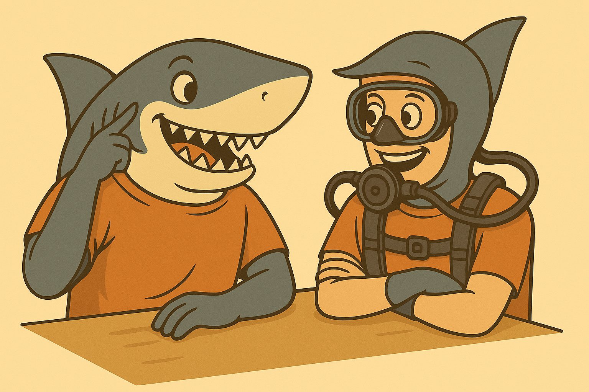

# How CNNs and ViTs perceive similarities between categories

Is a Poodle similar to a Husky? **Are sharks and scuba divers related?** Answering such questions is a standard human ability. Similarity perception of deep networks can also tell us a lot about them, therefore in this repository, we provide som methods to examine how deep networks align their similarity perception with semantic and other networks. 

All of the provided methods can be used to examine how different Deep Learning models
(CNNs and ViTs) perceive similarities between known classes and compare this perception
with the one of other networks and with semantic similarity (we use WordNet path similarity
measure).

We provide jupyter notebooks with the implementation (and instructions) of the key methods
used in our study:

* generation of Class Similarity Matrices (CSMs) for different networks (from Keras and
PyTorch) and WordNet path similarity measure
* visualization of CSMs
* comparison of differents CSMs with cosine similarity and correlation measures
* printing the list of top K most similar classes for all ImageNet classes based on CSM
* printing the list of top K most similar pairs overall based on CSM

We implemented our methods in such a way as to make them as flexible as possible not
only for the easy reproduction of our experiments but hopefully also for potential studies of
other researchers. Note, that we use only some examplary models (that are compatible with
other freely available ones from Keras and PyTorch) just to show the operation of the
notebooks and to make the use of our materials easy for other researchers.

We use the following Python libraries:

* matplotlib (version 3.6.2)
* numpy (version 1.24.0)
* tensorflow (version 2.11.0)
* pytorch (version 1.13.1)
* nltk (version 3.8.1)
* sklearn (version 1.1.3)
* scipy (version 1.9.3)

The methods have a simple implememntation, so they will most probably work also with other versions of the libraries. 

We also provide an HTML version of the notebook.

> 📚 **Citation:**  
> For more infor, please refer to our paper and cite it if you find it useful :)
> Filus, K., & Domaska, J. (2025). *How CNNs and ViTs perceive similarities between categories*, ECML PKDD (Accepted - we will update the citation).  
